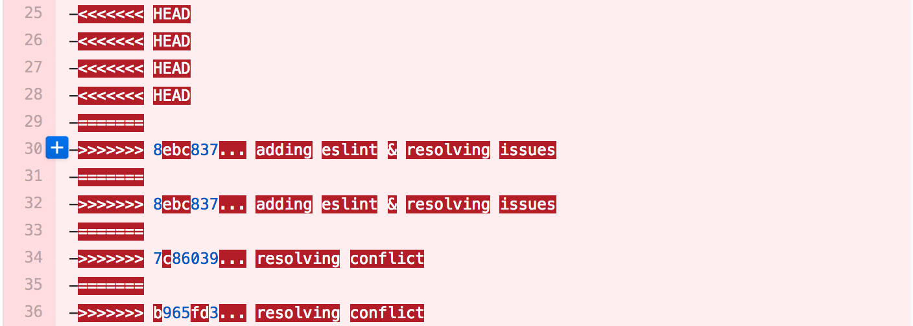

---

#### Disclosure:
I'm super lazy.  99.9% of this material is not original and has been borrowed by very smart reputable sources.  A listing of resources can be found at the end of this presentation.

---

## What is Git?
If you Google "What is git?" the first thing you will find is: 

> An unpleasant or contemptible person.

Thankfully that's not the type of git we're talking about today, as long as we keep Zach from speaking
<i class="fa fa-smile-o" aria-hidden="true"></i>

- The most widely used modern version control system in the world
- Performance - distributed architecture.  Everyone has a full copy to work with anytime and anywhere
- Smart - does not rely on file names for tracking, tracks contents
- Secure - uses a secure hashing algorithm called SHA1.  Difficult to tamper with the history
- Flexible - numerous workflows to choose
- Frustrating - it can be frustrating and *scary* to learn

The only appropriate commit message in this situation?

> Well, that got crazy

